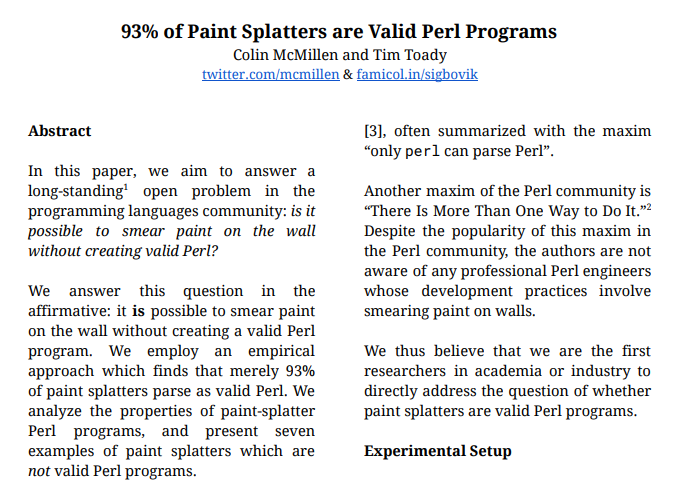

# Perl Primer

Getting Started with Perl

Perl, like Python, is a scripting language created in the late 1980s.

It is know for it's flexibility and powerful native text processing capabilities.

Perl's Offcial motto: 'There's more than one way to do it.'
A Practical Perl Motto: 'use the strict and warnings pragmas, be consitent, don't repeat yourself.'

Perl generally refers to Perl 5, which is what's used by Breedbase's server side code (specifically 5.8?).

*Add Perl camel graphic and photo of Larry Wall*

Note: 1987 vs 1989, Python from Monty Python and Perl from Pearl but Pearl was already taken. It has since been given the backronym ‘Practical Extraction and Reporting Language’.

<!--s-->

# Getting Started

Scripts should start with

```
#!/usr/bin/perl
use strict;
use warnings;
```

<!--s-->

# Why use pragmas?

Without them, almost *anything* is valid perl
<p align="left">
  
</p>
<p align="right">
  
</p>
https://famicol.in/sigbovik/2019.pdf

<!--s-->

# Some Key Differences from Python

'{}' and ';' are necessary because white space is not meaningful.

Different types of variables (scalar, array, and hash) are defined via a basic type system (‘$’, ‘@’, and ‘%’).

Not all variables are a reference, those that are require explicit dereferencing.

Both static (Lexical) and Dynamic scoping are possible, but the strict pragma enforces clear namespaces.

Perl core is larger, has more built-in features like text processing and sys/os interaction functions.

<!--s-->

# White Space


<!--s-->

# Basic Types


<!--s-->

# Referencing


<!--s-->

# Scoping

`my` provides lexical scoping; a variable declared with `my` is visible only within the block in which it is declared.
Blocks of code are hunks within curly braces `{}`; files are also blocks.
vars qw([list of var names]) or our (var_names]) can be used to create package globals.
rarely necessary, but local saves away the value of a package global and substitutes a new value for all code within and called from the block in which the local declaration is made.

(from https://www.perlmonks.org/?node_id=66677)

<!--s-->

# Language features

Perl regex examples

<!--s-->

# Some Additional Differences from Python

Strings can be single or doubled quoted like in Python, but only double quoted strings interpolate any control characters inside them. q and qq plus a seporator can be used in place of '' and "".

```
$s1 = "some string";
$s2 = "a string with\ncontrol characters\n";
$s3 = 'a "quoted" string';
$s4 = qq/a string with '" both kinds of quotes/;
$s5 = "another string with '\" both kinds of quotes";
$s6 = 'a stri\ng that au\tomatically escapes backslashes';

$name    = "Fred";
$title   = "Dr.";
$header = "Dear $title $name,";

print "$header\n"; # Prints "Dear Dr. Fred,"
```

<!--s-->

# Some Additional Differences from Python

Like Python's ''', perlpod can be used for docstrings or multi line comments. Start with `=` plus an optional type and title, end with `=cut`


<!--s-->

# Some Additional Differences from Python

Perl does not really have a length operator like Python. scalar() simply provides a scalar context, and in a scalar context an array returns its size

Perl: scalar(@A)

Python: len(A)

<!--s-->

# Some Additional Differences from Python

Perl uses closed intervals, while Python uses closed-open intervals.

Generate range of numbers:

Perl: (0..9)

Python: range(0, 10) or simply range(10) (assumes 0 as initial)

<!--s-->

# Some Additional Differences from Python

Perl has little native support for Object Oriented programming, but powerful packages to add OO support exist

Breedbase uses Moose

```
package Point;
use Moose; # automatically turns on strict and warnings

has 'x' => (is => 'rw', isa => 'Int');
has 'y' => (is => 'rw', isa => 'Int');

sub clear {
    my $self = shift;
    $self->x(0);
    $self->y(0);
}

package Point3D;
use Moose;

extends 'Point';

has 'z' => (is => 'rw', isa => 'Int');

after 'clear' => sub {
    my $self = shift;
    $self->z(0);
};
```


<!--s-->

# Additional Resources

Table of equivalent terms from each language - https://www.lemoda.net/perl/perl-python/index.html

Side by Side code comparisons - https://wiki.python.org/moin/PerlPhrasebook

perl maven

cpan

<!--s-->
